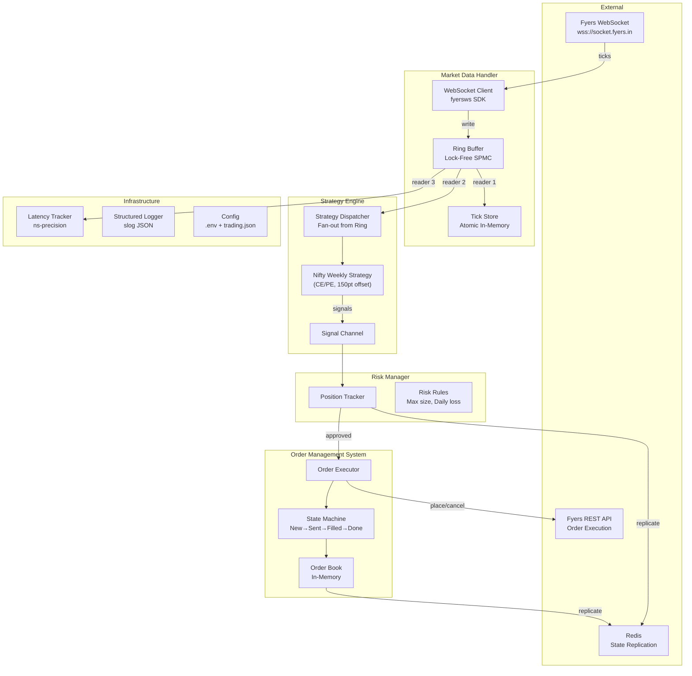

# Fyers Go — Nifty50 Weekly Options Trading System

Production-grade Go application for trading Nifty50 weekly options using the official **`github.com/FyersDev/fyers-go-sdk`**. Real-time WebSocket streaming, lock-free data paths, fully in-memory hot path with Redis state replication, and a containerized architecture designed for **cloud-agnostic deployment** (any VM with Docker).

## System Architecture



## Concurrency & Threading Architecture

The system uses **Go's goroutine/channel model** for all concurrency. Each component runs in its own goroutine(s) and communicates via typed channels — no shared mutable state on the hot path.

### Goroutine Map

| Goroutine | Count | Role | Communicates Via |
|-----------|-------|------|------------------|
| **WS Reader** | 1 | Receives ticks from Fyers WebSocket, writes to ring buffer | Ring buffer (atomic writes) |
| **TickStore Reader** | 1 | Reads ring → updates in-memory latest tick per symbol | Ring buffer cursor, `sync.Map` |
| **Latency Reader** | 1 | Reads ring → computes latency stats | Ring buffer cursor |
| **Strategy Dispatcher** | 1 | Reads ring → fans out to strategies → collects signals | Ring buffer cursor, `signalCh chan Signal` |
| **OMS Executor** | 1 | Consumes signals → risk check → places orders via REST | `signalCh`, `orderUpdateCh` |
| **Redis Replicator** | 1 | Periodically snapshots order book + positions to Redis | `time.Ticker`, reads in-memory state |
| **Config Watcher** | 1 | Watches `trading.json` for changes, hot-reloads | `fsnotify` or `time.Ticker` |

### Design Principles

| Concern | Approach |
|---------|----------|
| **Hot path (zero allocation)** | Ring buffer with `sync.Pool`-allocated ticks. No channels, no mutexes on the WS → ring → strategy path. |
| **Fully in-memory** | Order book, position book, and latest ticks all live in-memory (`sync.Map` / `sync.RWMutex`). No embedded DB — zero disk I/O on the trading path. |
| **Channel topology** | `signalCh` (strategy → OMS), `orderUpdateCh` (OMS → risk). Buffered channels (cap 256) prevent backpressure on fast producers. |
| **Deterministic logic** | Strategy engine is pure: same tick sequence → same signals. No randomness, no time-dependent branching in signal generation. |
| **Fault tolerance (Redis)** | Order book and position state are replicated to Redis every 5s. On restart, the system recovers last-known state from Redis before accepting new ticks. |
| **Graceful shutdown** | `context.WithCancel` propagated to all goroutines. Shutdown order: close WS → drain ring → snapshot to Redis → exit. |

### System Requirements & Rate Limits

> [!CAUTION]
> **SEBI retail algo regulations may change on April 1, 2026.** See [Fyers mandatory changes](https://myapi.fyers.in/mandatory-regulatory-changes#tag/Rate-Limits).

**Workload profile**: 2-3 instruments (strikes) per app instance. One Nifty index + 1-2 option strikes subscribed at any time.

| Fyers API Rate Limit | Limit | Our Usage |
|---|---|---|
| **Per second** | 10 orders | We place at most 1-2 orders per signal (rare events). Well within limit. |
| **Per minute** | 200 orders | Even with rapid strike changes, never exceeds 5-10/min. |
| **Per day** | 1,00,000 orders | Conservative estimate: <50 orders/day for weekly options. |

**Rate limiter in OMS**: Token bucket (`golang.org/x/time/rate`) set to 10 req/sec, burst 10. Every `fyModel.SingleOrderAction()` call passes through the limiter. If rate exceeded, the order is queued (not dropped) and retried after the cooldown.

### Memory Budget & CPU Cache Optimization

**~15MB is intentional** — the entire working set fits in **L3 cache**, and hot-path data stays in **L1/L2**.

#### CPU Cache Hierarchy (Typical Cloud VM e.g., AWS c5, GCP c2)

| Cache | Size | Latency | What Lives There |
|-------|------|---------|------------------|
| **L1** | ~64KB/core | **~1ns** | Current `TickEvent` being processed, ring buffer cursor (write head / read cursor), loop counters |
| **L2** | ~256KB-1MB/core | **~3-5ns** | Active symbols in TickStore (2-3 entries × 200B), strategy state (pending strike, timer), hot `sync.Map` entries |
| **L3** | ~8-32MB shared | **~10-15ns** | Full ring buffer (~12MB), entire order book, all positions, holiday map |
| **RAM** | GBs | **~50-100ns** | Go runtime, GC metadata, Redis client buffers, slog outputs |

#### Cache-Friendly Design Techniques

| Technique | Where Applied |
|-----------|---------------|
| **Contiguous memory** | Ring buffer is a single pre-allocated `[]TickEvent` array — sequential access = CPU prefetcher keeps next slots in L1/L2 |
| **Struct packing** | `TickEvent` keeps hot fields (Symbol, LTP, RecvTimestamp) first — accessed fields are in the same 64-byte cache line |
| **sync.Pool** | Reuses `TickEvent` structs — same memory addresses → already warm in cache |
| **Avoid pointers in hot structs** | `TickEvent` uses value types (float64, int64) not pointers — no pointer chasing, no cache misses |
| **Per-goroutine isolation** | Each ring reader has its own cursor — no false sharing between cores |

#### Memory Breakdown

| Component | Size | Growth |
|-----------|------|--------|
| Ring Buffer | ~12MB | Fixed (65536 slots × 200 bytes, allocated once at startup) |
| TickStore | ~50KB | Bounded (max 20 symbols, overwritten in-place) |
| Order Book | ~10KB | Bounded (handful of active orders) |
| Position Book | ~5KB | Bounded (1-2 active positions) |
| sync.Pool | ~1MB | Auto-shrinks via GC |
| **Total** | **~15MB** | **Fits in L3. Never grows unbounded.** |

GC tuning: `GOGC=400` reduces GC frequency. On your cloud provider, set `GOMAXPROCS` to pin to specific cores for stable L1/L2 residency where supported.

### Lag Handling (Skip-to-Latest)

| Scenario | Behavior |
|----------|----------|
| **Reader falls behind ring** | Ring is circular — writer overwrites old slots. Reader detects sequence gap, **skips to latest tick**, logs warning. Always acts on freshest data. |
| **Strategy takes too long** | Reads the latest available tick, skips intermediates. Only the latest Nifty LTP matters for ATM computation. |
| **WS SDK internal queue** | SDK has 1000-msg buffer. Our `onMessage` does ~200ns of work (stamp + copy to ring) — never backs up. |
| **GC pause (~1-2ms)** | Acceptable. `sync.Pool` + pre-allocation minimizes pause duration. |

### Failure Recovery

| Failure | Recovery |
|---------|----------|
| **WebSocket disconnect** | SDK auto-reconnects (50 retries, backoff). `onConnect` re-subscribes all symbols. Strategy resumes on next tick. |
| **App crash / restart** | Load last state from Redis (order book + positions). Worst case: lose 5s of state. |
| **Redis down** | System continues in-memory only with warning log. If app *also* crashes → fall back to `fyModel.GetPositions()` API to recover real positions from Fyers. |
| **Fyers API rejects order** | OMS marks order `REJECTED`, logs Fyers error message. No automatic retry on rejections. |
| **Docker OOM** | `restart: unless-stopped` auto-restarts. ~15MB usage makes OOM nearly impossible. |
| **Cloud VM terminates / Dies** | Setup a new VM and deploy. Since Redis was on the dead VM, the new instance will boot with empty state and **auto-recover via Fyers `GetPositions()` API** to resume trading safely. Fyers is the ultimate source of truth. |
| **Network Partition / ISP Drop** | WebSocket drops, `onDisconnect` triggers. System pauses trading. SDK auto-reconnects when network returns. Missing ticks are skipped (time marches forward). |

**Fallback chain**: Redis snapshot -> Fyers `GetPositions()` API -> start fresh with warning.

## User Review Required

> [!IMPORTANT]
> **Trading Config**: The system uses a separate `trading.json` config for CE/PE direction, ATM offset levels (150 above/below), and expiry. This can be hot-reloaded without restarting the app. Please confirm this approach.

> [!IMPORTANT]
> **Tuesday Expiry Logic**: From Tuesday (expiry day) onward, the system trades next week's expiry since current week options become very cheap. Confirm the cutoff should be from market open on Tuesday.

> [!WARNING]
> **Dry-Run Mode**: The initial build ships with `DRY_RUN=true` by default. No real orders will be placed until you explicitly set `DRY_RUN=false` in `.env`.

## Project Structure

```
c:\Users\jsrir\Desktop\startup\algotrading\fyers\
├── main.go                         # wires all components, shutdown
├── go.mod
├── .env.example                    # template for secrets
├── trading.json                    # trading config (CE/PE, levels, expiry)
├── Dockerfile                      # multi-stage build
├── docker-compose.yml              # local dev + EC2 deployment
├── Makefile                        # build, test, run, deploy
│
├── config/
│   └── config.go                   # .env + trading.json loader
│
├── symbols/
│   ├── nifty.go                    # symbol generation + ATM calculation
│   └── expiry.go                   # weekly expiry calculator
│
├── marketdata/
│   ├── tick.go                     # TickEvent struct + pool
│   ├── ringbuffer.go               # lock-free SPMC ring buffer
│   ├── client.go                   # fyersws wrapper → writes to ring
│   ├── tickstore.go                # latest tick per symbol (in-memory)
│   └── latency.go                  # latency measurement
│
├── strategy/
│   ├── strategy.go                 # Strategy interface + Signal
│   ├── engine.go                   # dispatcher: ring → fan-out
│   └── nifty_weekly.go             # weekly options strategy
│
├── oms/
│   ├── order.go                    # Order struct + state machine
│   ├── orderbook.go                # in-memory order book
│   └── executor.go                 # signals → Fyers REST API
│
├── infra/
│   └── redis.go                    # Redis client for state replication
│
└── risk/
    ├── manager.go                  # position tracking, signal gating
    └── rules.go                    # risk rules enforcement
```

---

## Proposed Changes

### Configuration

#### [NEW] [.env.example](file:///c:/Users/jsrir/Desktop/startup/algotrading/fyers/.env.example)
All authentication secrets and operational flags:
```env
FYERS_APP_ID=AAAAAAAAA-100
FYERS_APP_SECRET=XY...
FYERS_ACCESS_TOKEN=eyjb...
FYERS_REDIRECT_URL=https://trade.fyers.in/api-login/redirect-uri/index.html
DRY_RUN=true
LOG_LEVEL=info
LOG_FORMAT=json
RING_BUFFER_SIZE=65536
LATENCY_REPORT_INTERVAL=30s
REDIS_URL=redis://localhost:6379/0
REDIS_STATE_SYNC_INTERVAL=5s
ENV=development
```

#### [NEW] [trading.json](file:///c:/Users/jsrir/Desktop/startup/algotrading/fyers/trading.json)
Hot-reloadable trading parameters:
```json
{
    "trade_direction": "CE",
    "expiry_week": 0,
    "ce_offset_points": 150,
    "pe_offset_points": 150,
    "lot_size": 25,
    "num_lots": 1,
    "product_type": "INTRADAY",
    "order_type": "MARKET",
    "strike_change_confirm_seconds": 120,
    "max_position_value": 500000,
    "max_daily_loss": 10000,
    "trading_start_time": "09:20",
    "trading_end_time": "15:15"
}
```
- `expiry_week`: **0** = current week expiry, **1** = next week expiry. Change this to manually override the automatic Tuesday logic.

#### [NEW] [config.go](file:///c:/Users/jsrir/Desktop/startup/algotrading/fyers/config/config.go)
- Loads `.env` via `godotenv`, reads `trading.json`
- `AppConfig` struct for auth secrets + infrastructure params
- `TradingConfig` struct for strategy params
- `ReloadTradingConfig()` for hot-reload without restart
- Validation on all fields

---

### Symbol Management

#### [NEW] [nifty.go](file:///c:/Users/jsrir/Desktop/startup/algotrading/fyers/symbols/nifty.go)
- `NiftyIndexSymbol()` → `"NSE:NIFTY50-INDEX"`
- `BuildOptionSymbol(expiry, strike, optType)` → `"NSE:NIFTY2530623500CE"`
- `RoundToStrike(price, step)` → rounds to nearest 50
- `ComputeATMStrike(niftyLTP)` → rounds LTP to nearest 50
- `ComputeCEStrike(atm, offset)` and `ComputePEStrike(atm, offset)` — applies the 150pt offsets

#### [NEW] [expiry.go](file:///c:/Users/jsrir/Desktop/startup/algotrading/fyers/symbols/expiry.go)
Direct Go port of the proven Python expiry logic:
```go
// GetNearestExpiry finds the next Nifty50 weekly expiry.
// Post Aug 28, 2025: always Tuesday (weekday=1).
// If expiry falls on a holiday/weekend, walks BACKWARDS to previous trading day.
func GetNearestExpiry(tradeDate time.Time) time.Time {
    expiryWeekday := time.Tuesday // always Tuesday post-2025

    daysAhead := int(expiryWeekday - tradeDate.Weekday())
    if daysAhead < 0 {
        daysAhead += 7
    }
    expiry := tradeDate.AddDate(0, 0, daysAhead)

    // Walk backwards if holiday or weekend
    for IsNSEHoliday(expiry) || expiry.Weekday() == time.Saturday || expiry.Weekday() == time.Sunday {
        expiry = expiry.AddDate(0, 0, -1)
    }
    return expiry
}
```
- `GetTradingExpiry(now, expiryWeek)` → if `expiry_week=0`: calls `GetNearestExpiry(now)` (current week). If `expiry_week=1`: calls `GetNearestExpiry(now + 7 days)` (next week).
- `FormatExpiryForSymbol(date)` → formats to Fyers convention (e.g., `"25306"` for March 6, 2025)
- **Hardcoded NSE 2026 holidays**:
  ```go
  var NSEHolidays2026 = map[string]bool{
      "2026-01-26": true, // Republic Day
      "2026-03-03": true, // Holi
      "2026-03-26": true, // Shri Ram Navami
      "2026-03-31": true, // Shri Mahavir Jayanti
      "2026-04-03": true, // Good Friday
      "2026-04-14": true, // Dr. Ambedkar Jayanti
      "2026-05-01": true, // Maharashtra Day
      "2026-05-28": true, // Bakri Id
      "2026-06-26": true, // Muharram
      "2026-09-14": true, // Ganesh Chaturthi
      "2026-10-02": true, // Mahatma Gandhi Jayanti
      "2026-11-08": true, // Diwali (Muhurat)
      "2026-12-25": true, // Christmas
  }
  ```
- `IsNSEHoliday(date)` → `O(1)` map lookup on `"YYYY-MM-DD"` formatted date
- `ValidateExpiry(expiryDate)` → **called at startup**, logs the resolved expiry. If it was shifted due to holiday, logs warning with original → resolved dates.

---

### Market Data Handler

#### [NEW] [tick.go](file:///c:/Users/jsrir/Desktop/startup/algotrading/fyers/marketdata/tick.go)
```go
type TickEvent struct {
    Symbol        string
    LTP           float64
    Open, High, Low, Close float64
    Volume        int64
    BidPrice      float64
    AskPrice      float64
    Change        float64
    ChangePercent float64
    ExchTimestamp  int64     // from exchange
    RecvTimestamp  int64     // time.Now().UnixNano() at receive
}
```
- `sync.Pool` for pre-allocated `TickEvent` structs

#### [NEW] [ringbuffer.go](file:///c:/Users/jsrir/Desktop/startup/algotrading/fyers/marketdata/ringbuffer.go)
Lock-free Single-Producer, Multiple-Consumer ring buffer (power-of-2 size):
- `NewRingBuffer(size)` — creates buffer with `size` slots
- `Write(tick)` — producer writes with `atomic.StoreUint64` on sequence
- `NewReader()` → `Reader` with its own cursor
- `Reader.Next()` → returns next tick, blocks via spin-wait with `runtime.Gosched()`

#### [NEW] [client.go](file:///c:/Users/jsrir/Desktop/startup/algotrading/fyers/marketdata/client.go)
Wraps `fyersws.NewFyersDataSocket`:
- `onMessage` callback: stamps `RecvTimestamp`, parses SDK `DataResponse` (which is `map[string]interface{}`) → `TickEvent`, writes to ring buffer
- Handles `SymbolUpdate` data type (live LTP, OHLC, volume)
- `Subscribe(symbols)` / `Unsubscribe(symbols)` — for dynamic strike switching
- Auto-reconnect enabled (50 retries)

#### [NEW] [tickstore.go](file:///c:/Users/jsrir/Desktop/startup/algotrading/fyers/marketdata/tickstore.go)
- `sync.Map`-based latest tick per symbol
- Ring buffer reader goroutine updates continuously
- `Get(symbol)` → O(1) lookup


#### [NEW] [latency.go](file:///c:/Users/jsrir/Desktop/startup/algotrading/fyers/marketdata/latency.go)
- Ring buffer reader measuring `RecvTimestamp - ExchTimestamp`
- Rolling p50/p95/p99 stats, logged every 30s
- Ticks/sec throughput counter

---

### Strategy Engine

#### [NEW] [strategy.go](file:///c:/Users/jsrir/Desktop/startup/algotrading/fyers/strategy/strategy.go)
```go
type Strategy interface {
    Name() string
    Init(tickStore *marketdata.TickStore, cfg *config.TradingConfig)
    OnTick(tick marketdata.TickEvent) *Signal
    OnShutdown()
}

type Signal struct {
    Action    string    // "BUY" / "SELL"
    Symbol    string
    Qty       int
    OrderType string   // "MARKET" / "LIMIT"
    Price     float64
    Tag       string   // strategy name
    Reason    string   // human-readable reason
}
```

#### [NEW] [engine.go](file:///c:/Users/jsrir/Desktop/startup/algotrading/fyers/strategy/engine.go)
- Reads from ring buffer with its own cursor
- Calls `OnTick()` on each registered strategy
- Sends non-nil signals to OMS via Go channel

#### [NEW] [nifty_weekly.go](file:///c:/Users/jsrir/Desktop/startup/algotrading/fyers/strategy/nifty_weekly.go)
The core strategy implementing all user requirements:
1. **CE/PE Selection**: Reads `trade_direction` from `TradingConfig` — trades only CE or PE in a given day
2. **Strike Calculation**: For CE → ATM + 150pts; For PE → ATM - 150pts (configurable offsets)
3. **2-Minute Strike Change Confirmation**: When Nifty moves such that a new ATM is computed:
   - Records the intended new strike and timestamp
   - Waits 120 seconds
   - If after 2 minutes the price still warrants the new strike → executes the change
   - If price reverts → cancels the pending change
4. **Dynamic Subscription**: On confirmed strike change:
   - Unsubscribes from old strike's WebSocket symbol
   - Subscribes to new strike's WebSocket symbol
5. **Expiry Logic**: Uses `symbols.GetTradingExpiry()` — from Tuesday onward, trades next week's expiry

---

### Order Management System

#### [NEW] [order.go](file:///c:/Users/jsrir/Desktop/startup/algotrading/fyers/oms/order.go)
```go
type OrderState string
const (
    OrderNew       OrderState = "NEW"
    OrderPending   OrderState = "PENDING"
    OrderSent      OrderState = "SENT"
    OrderFilled    OrderState = "FILLED"
    OrderRejected  OrderState = "REJECTED"
    OrderCancelled OrderState = "CANCELLED"
)

type Order struct {
    ID          string
    Symbol      string
    Side        string     // "BUY" / "SELL"
    Qty         int
    FilledQty   int
    Price       float64
    State       OrderState
    StrategyTag string
    FyersOrderID string
    CreatedAt   time.Time
    UpdatedAt   time.Time
}
```
- State machine with valid transitions enforced

#### [NEW] [orderbook.go](file:///c:/Users/jsrir/Desktop/startup/algotrading/fyers/oms/orderbook.go)
- In-memory order book with `sync.RWMutex`
- `Add`, `Get`, `GetByTag`, `ActiveOrders`, `AllOrders`

#### [NEW] [executor.go](file:///c:/Users/jsrir/Desktop/startup/algotrading/fyers/oms/executor.go)
- Consumes signals from strategy channel
- Checks with Risk Manager before executing
- **Rate limiter**: Token bucket (`golang.org/x/time/rate`) at 10 req/sec, burst 10. All Fyers API calls pass through it. If rate exceeded, order is queued and retried after cooldown.
- Converts `Signal` → `fyersgosdk.OrderRequest`:
  - `Side`: 1 (Buy) or -1 (Sell)
  - `Type`: 2 (Market) or 1 (Limit)
  - `ProductType`: "INTRADAY" or "MARGIN"
- **Dry-run mode**: Logs the order and updates state to FILLED without calling Fyers API
- **Live mode**: Calls `fyModel.SingleOrderAction()`, parses response, updates order state
- **Startup recovery**: Calls `fyModel.GetPositions()` as fallback if Redis state is missing

---

### Portfolio & Risk Manager

#### [NEW] [manager.go](file:///c:/Users/jsrir/Desktop/startup/algotrading/fyers/risk/manager.go)
- Tracks current positions: symbol → (qty, avgPrice, unrealizedPnL)
- Exposes `CheckSignal(signal) (bool, string)` — returns whether a signal is allowed
- Updates positions on fill events from OMS
- Calculates live P&L using `TickStore` data

#### [NEW] [rules.go](file:///c:/Users/jsrir/Desktop/startup/algotrading/fyers/risk/rules.go)
Enforced rules:
- **Max position size**: Rejects if total position value exceeds configured limit
- **Max daily loss**: Blocks all new trades if daily realized loss exceeds limit
- **Trading hours**: Only allows trades within configured window (09:20 - 15:15)
- **Single direction**: Ensures only CE or PE trades in a day (not both)

---

### State Replication (Redis)

#### [NEW] [redis.go](file:///c:/Users/jsrir/Desktop/startup/algotrading/fyers/infra/redis.go)
Redis client for fault-tolerant state replication:
- Uses `github.com/redis/go-redis/v9`
- **Replicator goroutine**: every `REDIS_STATE_SYNC_INTERVAL` (default 5s), snapshots order book + positions to Redis as JSON hashes
- `SaveState(orderBook, positions)` → `HSET fyers:orders ...`, `HSET fyers:positions ...`
- `LoadState()` → on startup, recovers last-known order book and positions from Redis
- If Redis is unavailable, the system continues in-memory-only mode with a warning log

---

### Application Entry Point

#### [NEW] [main.go](file:///c:/Users/jsrir/Desktop/startup/algotrading/fyers/main.go)
Startup sequence:
```
Load .env → Load trading.json → Init logger
→ Validate expiry date against hardcoded NSE holidays (abort if invalid)
→ Connect Redis → Recover state (order book + positions) if available
→ Init RingBuffer
→ Init WS Client (writes to ring)
→ Start goroutines: TickStore reader, Latency reader
→ Init Risk Manager (in-memory, replicated to Redis)
→ Init Strategy Engine goroutine (reads from ring → signalCh)
→ Init OMS Executor goroutine (consumes signalCh, gated by risk)
→ Start Redis replicator goroutine
→ Subscribe to Nifty index + initial option strikes
→ Wait for SIGINT/SIGTERM
→ Graceful shutdown: close WS → drain ring → snapshot to Redis → exit
```

---

### Deployment (Docker-based)

#### [NEW] [Dockerfile](file:///c:/Users/jsrir/Desktop/startup/algotrading/fyers/Dockerfile)
Multi-stage build for minimal production image:
```dockerfile
# Stage 1: Build
FROM golang:1.22-alpine AS builder
WORKDIR /app
COPY go.mod go.sum ./
RUN go mod download
COPY . .
RUN CGO_ENABLED=0 GOOS=linux GOARCH=amd64 go build -ldflags="-s -w" -o /fyers-trading .

# Stage 2: Runtime (~10MB image)
FROM alpine:3.19
RUN apk add --no-cache ca-certificates tzdata
COPY --from=builder /fyers-trading /usr/local/bin/
ENTRYPOINT ["fyers-trading"]
```

#### [NEW] [docker-compose.yml](file:///c:/Users/jsrir/Desktop/startup/algotrading/fyers/docker-compose.yml)
```yaml
services:
  redis:
    image: redis:7-alpine
    restart: unless-stopped
    volumes:
      - redisdata:/data
    command: redis-server --save 60 1 --loglevel warning

  fyers-trading:
    build: .
    restart: unless-stopped
    env_file: .env
    depends_on: [redis]
    volumes:
      - ./trading.json:/app/trading.json:ro
    logging:
      driver: json-file
      options: { max-size: "50m", max-file: "5" }

volumes:
  redisdata:
```

#### [NEW] [Makefile](file:///c:/Users/jsrir/Desktop/startup/algotrading/fyers/Makefile)
```makefile
build:          docker compose build
run:            docker compose up -d
stop:           docker compose down
logs:           docker compose logs -f --tail=100
test:           go test ./...
vet:            go vet ./...
build-local:    go build -o bin/fyers-trading.exe .
deploy:         docker save fyers-trading | ssh user@$(HOST) docker load
```

#### Generic Cloud Deployment (Any VM)
On any Linux VM (AWS, GCP, DigitalOcean, etc), install Docker + Docker Compose, then:
```bash
# Copy files to VM
scp .env trading.json docker-compose.yml user@$HOST:~/fyers/
# Deploy the image
make deploy HOST=$HOST
# SSH in and start
ssh user@$HOST "cd fyers && docker compose up -d"
```

---

## Verification Plan

### Build Verification
Run from `c:\Users\jsrir\Desktop\startup\algotrading\fyers`:
```powershell
go build ./...
go vet ./...
```
Both must pass with zero errors.

### Startup Expiry Validation
1. Verify the system checks computed expiry against hardcoded NSE 2026 holidays
2. If expiry falls on a holiday (e.g., March 3 Holi), verify it shifts to previous trading day and logs warning
3. Test `expiry_week: 0` (current week) and `expiry_week: 1` (next week) both produce correct symbols

### Dry-Run Verification
1. Set `DRY_RUN=true` in `.env`
2. Run `docker compose up` (or `go run .` locally)
3. Verify: structured JSON logs appear with connection status, tick data, and strategy signals
4. Verify: no actual orders are placed (log says "DRY RUN: would place order...")
5. Ctrl+C → verify clean shutdown, final Redis snapshot written

### Config Hot-Reload Test
1. While running, edit `trading.json` to change `trade_direction` from `"CE"` to `"PE"`
2. Send SIGHUP to process (or the system can use file-watcher)
3. Verify logs show "Trading config reloaded" and subsequent signals use PE strikes

### Manual Verification (User)
> [!NOTE]
> Full live testing requires a valid Fyers access token. The user should:
> 1. Fill in `.env` with real credentials
> 2. Run with `DRY_RUN=true` first to verify data streaming works
> 3. Once satisfied, set `DRY_RUN=false` for live trading
